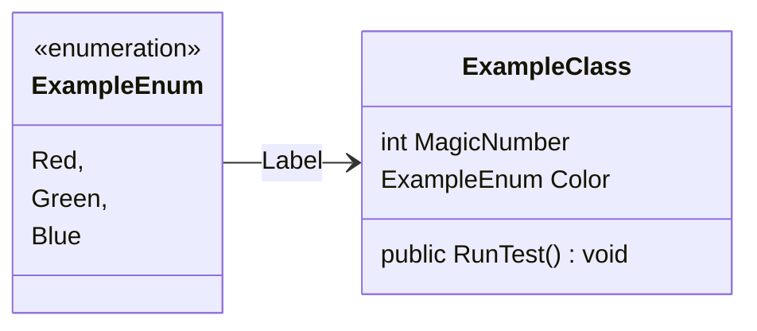
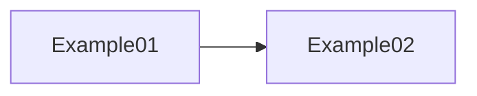

# Underlines
__ 
<u>text to see the underline</u>

# Skill Checks
/skill-check 
DC X Ability ([Skill](https://www.dndbeyond.com/sources/dnd/free-rules/playing-the-game#Skills)) check

# Broken Links
/broken-link 
<a class="broken-link">link[broken link]</a>

# Currency

## Copper Piece
/cp 
![[Vault Assets/Currency/copper.svg|16]]

## Silver Piece
/sp 
![[Vault Assets/Currency/silver.svg|16]]

## Electrum Piece
/ep 
![[Vault Assets/Currency/electrum.svg|16]]

## Gold Piece
/gp 
![[Vault Assets/Currency/gold.svg|16]]

## Platinum Piece
/pp 
![[Vault Assets/Currency/platinum.svg|16]]

# Callouts

## Note
/note 
> [!note] [[Template File|Misc > Slash Commands - Global > Template File]]

## List
/list 
> [!list] List
> - Item 1
> - Item 2
> - Item 3

/list-f 
> [!list]- List
> - Item 1
> - Item 2
> - Item 3

## Abstract
/abstract 
> [!abstract] Abstract
> ![[gold.svg]]

/abstract-f 
> [!abstract]- Abstract
> ![[gold.svg]]

## Info
/info 
> [!info] Info
> Placeholder text.

/info-f 
> [!info]- Info
> Placeholder text.

## TO-DO
/todo 
> [!todo] TO-DO
> - [ ] Item 1
> - [ ] Item 2
> - [ ] Item 3

/todo-f 
> [!todo]- TO-DO
> - [ ] Item 1
> - [ ] Item 2
> - [ ] Item 3

## Tip
/tip 
> [!tip] Tip
> Placeholder text.

/tip-f 
> [!tip]- Tip
> Placeholder text.

## Success
/success 
> [!success] Success

## Question
/question 
> [!question] Question
> Placeholder text.

/question-f 
> [!question]- Question
> Placeholder text.

## Warning
/warning 
> [!warning] Warning

## Failure
/failure 
> [!failure] Failure

## Danger
/danger 
> [!danger] Danger
> Placeholder text.

/danger-f 
> [!danger]- Danger
> Placeholder text.

## Bug
/bug 
> [!bug] Bug
> Placeholder text.

/bug-f 
> [!bug]- Bug
> Placeholder text.

## Example
/example 
> [!example] Example
> Placeholder text.
> > **Example:**
> > Placeholder text.

/example-f 
> [!example]- Example
> Placeholder text.
> > **Example:**
> > Placeholder text.

## Quote
/quote 
> [!quote] Quote
> \- Placeholder text.

## Folder
/folder 

> [!folder]- Folder
> Placeholder text.

> [!folder]- Folder
> Placeholder text.
> > [!folder]- Folder
> > Placeholder text.

> [!folder]- Folder
> Placeholder text.
> > [!folder]- Folder
> > Placeholder text.
> > > [!folder]- Folder
> > > Placeholder text.

> [!folder]- Folder
> Placeholder text.
> > [!folder]- Folder
> > Placeholder text.
> > > [!folder]- Folder
> > > Placeholder text.
> > > > [!folder]- Folder
> > > > Placeholder text.

> [!folder]- Folder
> Placeholder text.
> > [!folder]- Folder
> > Placeholder text.
> > > [!folder]- Folder
> > > Placeholder text.
> > > > [!folder]- Folder
> > > > Placeholder text.
> > > > > [!folder]- Folder
> > > > > Placeholder text.

> [!folder]- Folder
> Placeholder text.
> > [!folder]- Folder
> > Placeholder text.
> > > [!folder]- Folder
> > > Placeholder text.
> > > > [!folder]- Folder
> > > > Placeholder text.
> > > > > [!folder]- Folder
> > > > > Placeholder text.
> > > > > > [!folder]- Folder
> > > > > > Placeholder text.

## Stat Blocks
/statblock 
> [!statblock]+ Name
> *Size Type, Alignment*
> 
> |**AC** # (Armor)|**Initiative** +# (#)|
> |---|---|
> |**HP** <input type="number" step="1" min="0" max="999" placeholder="#" value="" /> / # (#d# + #)|**Hit Die** <input type="number" step="1" min="0" max="999" placeholder="#" value="" /> / #|
> |**Speed** # ft.||
> 
> |||MOD|SAVE|||MOD|SAVE|
> |---|---|---|---|---|---|---|---|
> |**STR**|#|+#|+#|**INT**|#|+#|+#|
> |**DEX**|#|+#|+#|**WIS**|#|+#|+#|
> |**CON**|#|+#|+#|**CHA**|#|+#|+#|
> 
> **Skills** --
> **Senses** Passive Perception #
> **Languages** --
> **CR** #
> 
> ## Traits
> **Trait Name**
> Trait description.
> 
> **Trait Name**
> Trait description.
> 
> ## Actions
> **Action Name**
> Action description.
> 
> **Action Name**
> Action description.
> 
> ## Legendary Actions
> *Legendary Action Uses <input type="checkbox" checked /> <input type="checkbox" checked /> <input type="checkbox" checked /> *(*<input type="checkbox" checked /> <input type="checkbox" checked /> <input type="checkbox" checked /> <input type="checkbox" checked /> in Lair*)
> *Immediately after another creature's turn, {THE MONSTER} can expend a use to take one of the following actions.*
> *{THE MONSTER} regains all expended uses at the start of each of its turns.*
> 
> **Action Name**
> Action description.

# Checkboxes
/check 
<input type="checkbox" />

/checked 
<input type="checkbox" checked />

/check-d 
<input type="checkbox" disabled />

/checked-d 
<input type="checkbox" checked disabled />

# Progress Bars
/progress 
<input class="progress" type="range" min="0" max="100" value="100" disabled />

/progress-sm
<input class="progress" type="range" size="sm" min="0" max="3" value="2" disabled />

/progress-md 
<input class="progress" type="range" size="md" min="0" max="1" value="0" disabled />

/progress-lg 
<input class="progress" type="range" size="lg" min="0" max="20" value="3" disabled />

/progress-c 
<input class="progress" type="range" style="color: #f00;" size="sm" min="0" max="38" value="27" disabled />

# Maps
/map 
/marker 
```leaflet
# ID
id: template-viewer

# Map Image
image: [[Assets/Lost Verdana/olden_map_wip.png]]

# Map Canvas Size
width: 300px
height: 300px

# Initial Map View (Relative To Canvas)
lat: 50%
long: 50%

# Map Zoom
defaultZoom: 5.00
minZoom: 5.00
maxZoom: 10.00
zoomDelta: 0.25

# Disables UI
draw: false
noUI: true

marker: skyblue, -4.5444, 3.8086, , Lost Woods, 5.00, 10.00
```

# Mermaid

## Diagram
/diagram 


## Graph
/graph 


# Controller Icons
/controller-icon 

<div style="color: #bfbfbf;" class="controller-icon">▲</div><div style="color: #bfbfbf;" class="controller-icon">▼</div><div style="color: #bfbfbf;" class="controller-icon">◄</div><div style="color: #bfbfbf;" class="controller-icon">►</div>

<div style="color: #0f0;" class="controller-icon">A</div><div style="color: #f00;" class="controller-icon">B</div><div style="color: #ff7f00;" class="controller-icon">X</div><div style="color: #ff0;" class="controller-icon">Y</div>

<div style="color: #fff;" class="controller-icon">L</div><div style="color: #fff;" class="controller-icon">R</div><div style="color: #fff;" class="controller-icon">ZL</div><div style="color: #fff;" class="controller-icon">ZR</div>

<div style="color: #bfbfbf;" class="controller-icon">-</div><div style="color: #bfbfbf;" class="controller-icon">+</div>